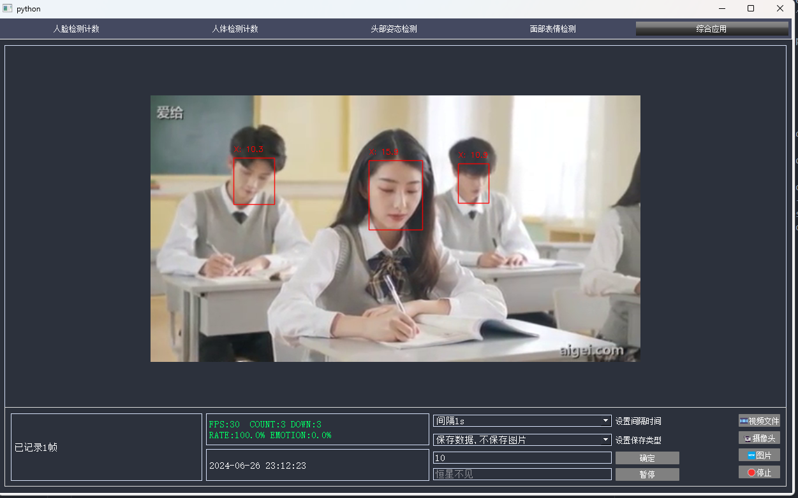
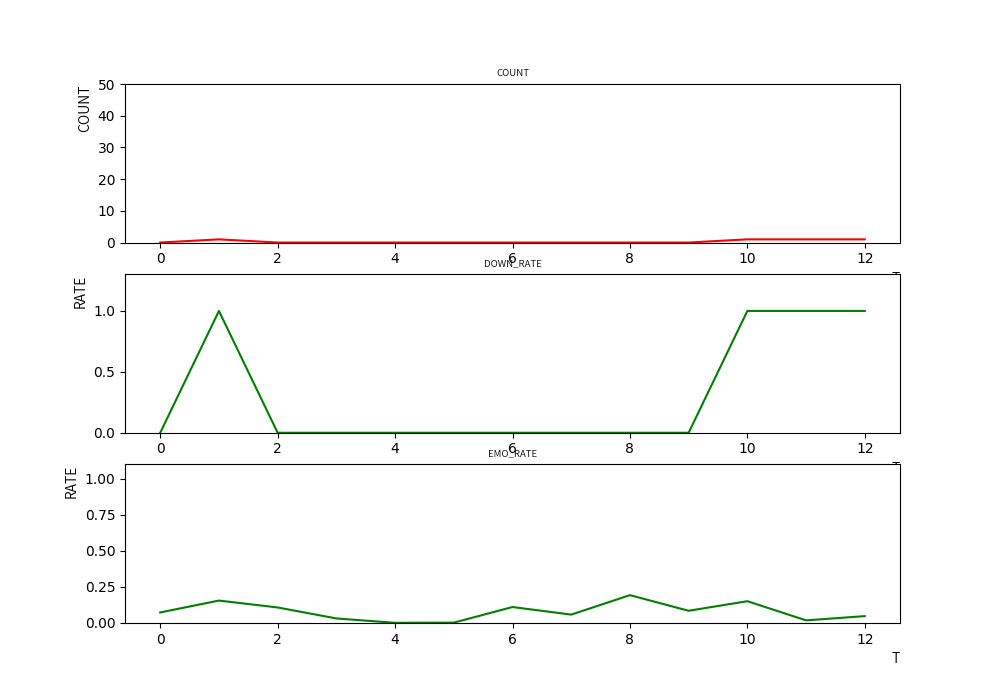
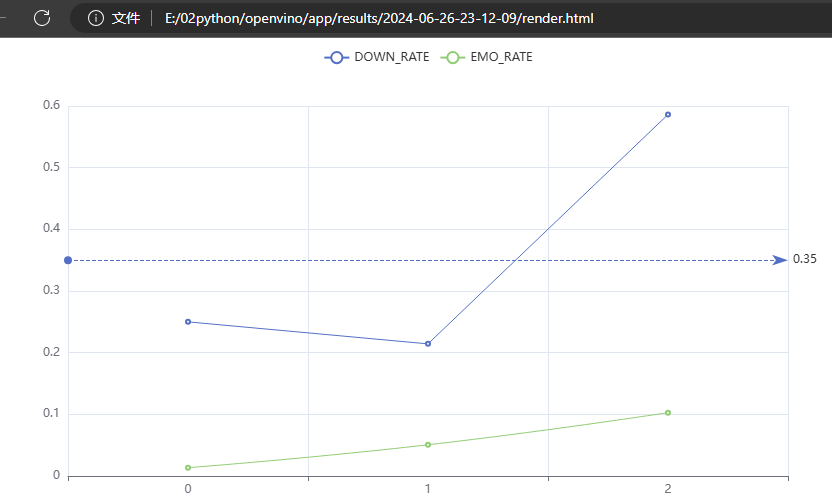

## openvino - YOLOv8-Face-count and dlib-headpose
  --- 
1. 下载项目代码

        git clone https://github.com/HXBJ1737/openvino_app.git
2. 下载模型 
    
        链接：https://pan.baidu.com/s/1V7_67vP6-tAIRjenoh52qw?pwd=hxbj 
        提取码：hxbj
    下载后将 models、video、xml_models、img 这四个文件夹放在主目录下

3. 环境配置  

        TODO

4. 运行

        python app.py

```  
程序目录:
├─api # api接口
├─img   #测试图片
├─models #模型文件
│  ├─dlib_models #dlib模型
│  ├─onnx_model #onnx模型
│  ├─pt_model #pytorch模型
│  └─RFB-320 #表情分类模型
├─results #测试结果
│  ├─2024-06-26-13-26-38 #开始时间
│     └─ img_with_label #带标记的图片
│     └─ data.csv #统计数据
│     └─ graph.png #统计图
│     └─ render.html #结果HTML
├─src #无QT界面的代码
├─ultralytics #YOLOV8源码
├─video #测试视频
├─xml_models #openvino IR模型
└─app.py #程序主入口，包含以下五个模块
└─com.py #综合应用模块
└─count_face.py #人脸计数(openvino、YOLOv8)
└─count_person.py #人体计数(openvino、YOLOv8)
└─expression.py #表情分类 (opencv.dnn)
└─head_pose.py #头部姿态 (YOLOv8级联Dlib人脸关键点)
└─load.py #加载模型(单例模式)
└─qss.py #QSS样式
```





